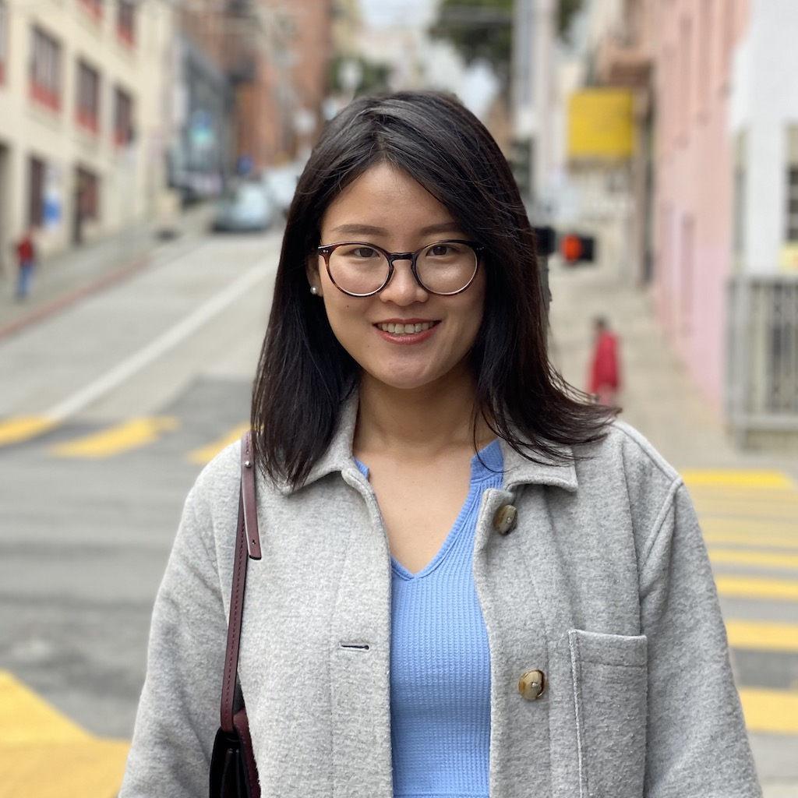
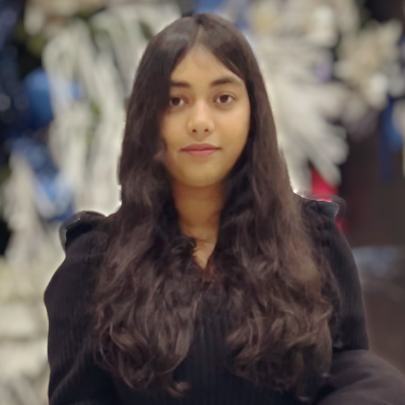
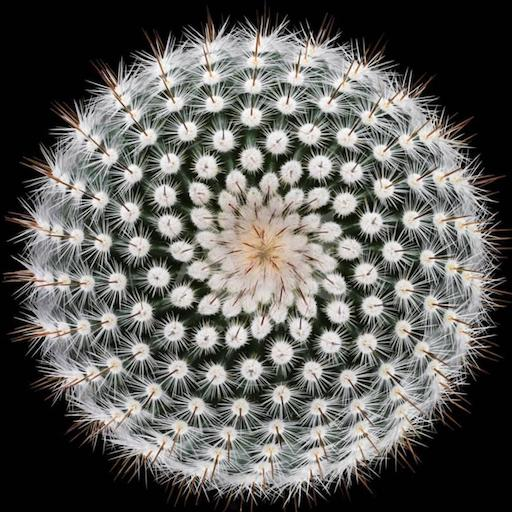
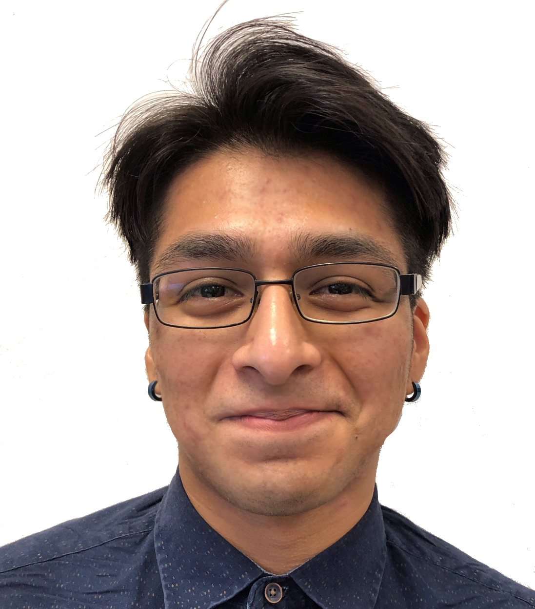
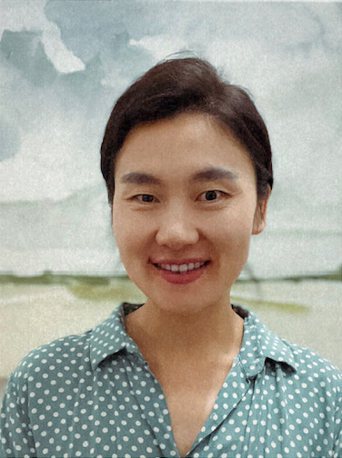

## The SCOPA Lab

Below you can find a list of the current and past members of the SCOPA lab.

### Current Team Members

<table border="0" width="100%">
<col style="width:30%">
<col style="width:70%">
<tbody>
<!-- ####################################### -->
<tr>
<td>
<p align="center"></p>
</td>
<td>
Li Meng<br>
Role: Graduate Student<br>
Research: Bayesian Inference<br>
[<a href="https://github.com/limeng-math">https://github.com/limeng-math</a>]<br>
<a href ="mailto:lmeng3@cougarnet.uh.edu">Send Email</a>
</td>
</tr>
<!-- ####################################### -->
<tr>
<td>
<p align="center"></p>
</td>
<td>
Jannatul Chhoa<br>
Role: Graduate Student<br>
Research: Optimal Control, Inverse Problems<br>
[<a href="https://chhoa.github.io">https://chhoa.github.io</a>]<br>
<a href ="mailto:jchhoa@cougarnet.uh.edu">Send Email</a>
</td>
</tr>
<!-- ####################################### -->
<tr>
<td>
<p align="center"></p>
</td>
<td>
Radmir Sultamuratov<br>
Role: Graduate Student<br>
Research: Optimal Control, Machine Learning<br>
<!--
[<a href="https://github.com/limeng-math">https://github.com/limeng-math</a>]
 -->
<a href ="mailto:rsultamu@cougarnet.uh.edu">Send Email</a>
</td>
</tr>
<!-- ####################################### -->
<tr>
<td>
<p align="center"></p>
</td>
<td>
German Villalobos<br>
Role: Graduate Student<br>
Research: Scientific Machine Learning, Bayesian Inference<br>
<a href ="mailto:gvillal2@central.uh.edu">Send Email</a>
<!--
[<a href="https://github.com/limeng-math">https://github.com/limeng-math</a>]
 -->
</td>
</tr>
</tbody>
</table>


### Former Team Members
* Dr. Jae Youn Kim (PhD student; 2018-2023).
* Danial Khan (UG; SURF Recipient; SU 2022).
* Syed Abidi (UG; PURS & SURF Recipient; SP & SU 2021).
* Yaseen Syed (UG; PURS Recipient; SP 2021).
* Dr. Saeed (Sorena) Sarmadi (PhD student; co-advised with Dr. R. Azencott; 2017-2020).
* Haley Rosso (UG; SURF Recipient; SU 2020).
* Dr. James L. Herring (PD; 2018-2019).
* Gundeep Singh (UG; PURS Recipient; SU 2019 & FA 2021).
* Felix Huber (VS; co-advised with Dr. M. Schulte; 2018-2019).
* Brenda Gonzalez (UG; SURF Recipient; SU 2018).
* Orion Lowy (UG; co-advised with Dr. B. Bodmann; SU 2018).


### Former PhD Students
<table border="0" width="100%">
<col style="width:30%">
<col style="width:70%">
<tbody>
<!-- ####################################### -->
<tr>
<td>
<p align="center"></p>
</td>
<td>
Dr. Jae Youn Kim<br>
Thesis: <i>Efficient numerical methods for initial value control problems for diffeomorphic image registration</i><br>
Date of Graduation: 08/2023<br>
Next Employment: Associate Lecturer, Department of Mathematics, University of Houston
</td>
</tr>
</tbody>
</table>


### Group Pictures
#### October 2023 


<table border="0" width="100%">
<col style="width:30%">
<col style="width:70%">
<tbody>
<!-- ####################################### -->
<tr>
<td>
<p align="center"></p>
</td>
<td>
<p align="left">Li, Jae, Chhoa, Radmir, Andreas, and German</p>
</td>
</tr>
<!-- ####################################### -->
<tr>
<td>
<p align="center"></p>
</td>
<td>
<p align="left">Radmir, Li, Chhoa, Jae, Andreas, and German</p>
</td>
</tr>
</tbody>
</table>


### Contact
```
Andreas Mang [/an'dre:as maŋ/]
Associate Professor
Department of Mathematics
College of Natural Sciences & Mathematics
University of Houston

Philip Guthrie Hoffman Hall (PGH), Office 614
3551 Cullen Blvd.
Houston, TX, 77204-3008
Email: andreas at math dot uh dot edu
Phone: (+1)713-743-7409
Web: https://www.math.uh.edu/~andreas
```
