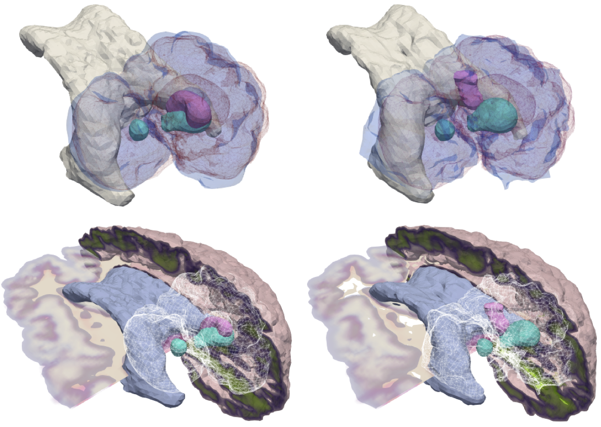

# Publications

Go back to [README.md](../README.md).

<table border="0" width="100%">
<col style="width:20%">
<col style="width:80%">
<tbody>
<!-- ####################################### -->
<tr>
<td>

</td>
<td>
"<i>CLAIRE: Constrained large deformation diffeomorphic image registration on parallel computing architectures</i>"
by M. Brunn, N. Himthani, G. Biros, M. Mehl & A. Mang in
Journal of Open Source Software, 6(61), 3038, 2021.
 
[<a href="https://doi.org/10.21105/joss.03038">doi:10.21105/joss.03038</a>]
</td>
</tr>
<!-- ####################################### -->
<tr>
<td>

</td>
<td>
"<i>Diffeomorphic shape matching by operator splitting in 3D cardiology imaging</i>"
by P. Zhang, A Mang, J. He, R. Azencott, K. C. El-Tallawi, & W. A. Zoghbi in
Journal of Optimization Theory and Applications, 188:143--168, 2021.
 
[<a href="https://doi.org/10.1007/s10957-020-01789-5">doi:10.1007/s10957-020-01789-5</a>]
[<a href="https://arxiv.org/abs/2011.10165">arXiv:2011.10165</a>]
</td>
</tr>
<!-- ####################################### -->
<tr>
<td>

</td>
<td>
"<i>Estimating glioblastoma biophysical growth parameters using deep learning regression</i>"
by S. Pati, V. Sharma, H. Aslam, S. Thakur, H. Akbari, A. Mang, S. Subramanian, G. Biros, C. Davatzikos & S. Bakas in
Proc. International MICCAI Brainlesion Workshop, LNCS 12658, pp. 157--167, 2021.
 
[<a href="https://doi.org/10.1007/978-3-030-72084-1_15">doi:10.1007/978-3-030-72084-1_15</a>]
</td>
</tr>
<!-- ####################################### -->
<tr>
<td>
</td>
<td>
"<i>Fast GPU 3D diffeomorphic image registration</i>"
by M. Brunn, N. Himthani, G. Biros, M. Mehl & A. Mang in
Journal of Parallel and Distributed Computing, 149:149--162, 2021.
 
[<a href="https://doi.org/10.1016/j.jpdc.2020.11.006">doi:10.1016/j.jpdc.2020.11.006</a>]
[<a href="https://arxiv.org/abs/2004.08893">arXiv:2004.08893</a>]
</td>
</tr>
<!-- ####################################### -->
<tr>
<td>
</td>
<td>
"<i>Integrated biophysical modeling and image analysis: Application to neuro-oncology</i>"
by A. Mang, S. Bakas, S. Subramanian, G. Biros & C. Davatzikos in
Annual Review of Biomedical Engineering, 22:309--341, 2020.
 
[<a href="https://doi.org/10.1146/annurev-bioeng-062117-121105">doi:10.1146/annurev-bioeng-062117-121105</a>]
[<a href="https://arxiv.org/abs/2002.09628">arXiv:2002.09628</a>]
</td>
</tr>
<!-- ####################################### -->
<tr>
<td>

</td>
<td>
"<i>Image-driven biophysical tumor growth model calibration</i>"
by K. Scheufele, S. Subramanian, A. Mang, G. Biros & M. Mehl in
SIAM Journal on Scientific Computing, 42(3):B549--B580, 2020.
 
[<a href="https://doi.org/10.1137/19M1275280">doi:19M1275280</a>]
[<a href="https://arxiv.org/abs/1907.07774">arXiv:1907.07774</a>]
</td>
</tr>
<!-- ####################################### -->
<tr>
<td>

</td>
<td>
"<i>CLAIRE: A distributed-memory solver for constrained large deformation diffeomorphic image registration</i>"
by A. Mang, A. Gholami, C. Davatzikos & G. Biros in
SIAM Journal on Scientific Computing, 41(5):C548--C584, 2019.
 
[<a href="https://doi.org/10.1137/18M1207818">doi:10.1137/18M1207818</a>]
[<a href="https://arxiv.org/abs/1808.04487">arXiv:1808.04487</a>]
</td>
</tr>
<!-- ####################################### -->
<tr>
<td>

</td>
<td>
"<i>Coupling brain-tumor biophysical models and diffeomorphic image registration</i>"
by K. Scheufele, A. Mang, A. Gholami, C. Davatzikos, G. Biros & M. Mehl in
Computer Methods in Applied Mechanics and Engineering, 347:533--567, 2019. 
[<a href="https://doi.org/10.1016/j.cma.2018.12.008">doi:10.1016/j.cma.2018.12.008</a>]
[<a href="https://arxiv.org/abs/1710.06420">arXiv:1710.06420</a>]
</td>
</tr>
<!-- ####################################### -->
<tr>
<td>

</td>
<td>
"<i>PDE-constrained optimization in medical image analysis</i>"
by A. Mang, A. Gholami, C. Davatzikos & G. Biros in
Optimization and Engineering, 19(3):765--812, 2018.
 
[<a href="https://doi.org/10.1007/s11081-018-9390-9">doi:10.1007/s11081-018-9390-9</a>]
[<a href="https://arxiv.org/abs/1803.00058">arXiv:1803.00058</a>]
</td>
</tr>
<!-- ####################################### -->
<tr>
<td>

</td>
<td>
"<i>Constrained H1 regularization schemes for diffeomorphic image registration</i>"
by A. Mang & G. Biros in
SIAM Journal on Imaging Sciences, 9(3):1154-1194, 2016.
 
[<a href="https://doi.org/10.1137/15M1010919">doi:10.1137/15M1010919</a>]
[<a href="https://arxiv.org/abs/1503.00757">arXiv:1503.00757</a>]
</td>
</tr>
<!-- ####################################### -->
<tr>
<td>

</td>
<td>
"<i>Biophysical modeling of brain tumor progression: From unconditionally stable explicit time integra- tion to an inverse problem with parabolic PDE constraints for model calibration</i>"
by A. Mang, A. Toma, T. A. Schuetz, S. Becker, C. Mohr, T. Eckey, D. Petersen & T. M. Buzug in
Medical Physics, 39(7):4444--4460, 2012.
 
[<a href="https://doi.org/10.1118/1.4722749">doi:10.1118/1.4722749</a>]
</td>
</tr>
</tbody>
</table>

