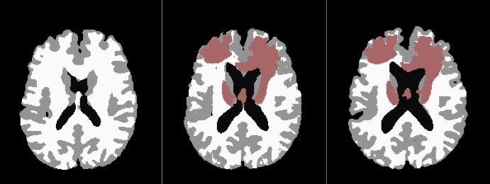

# Publications

<table>
<tr>
<td>

</td>
<td>
Coupling brain-tumor biophysical models and diffeomorphic image registration.
Computer Methods in Applied Mechanics and Engineering, 347:533-567, 2019.
with Klaudius Scheufele, Amir Gholami, Christos Davatzikos, George Biros & Miriam Mehl
doi:10.1016/j.cma.2018.12.008
arXiv:1710.06420
</td>
</tr>
</table>

| --- | --- |
!

 

! 
Coupling brain-tumor biophysical models and diffeomorphic image registration.
Computer Methods in Applied Mechanics and Engineering, 347:533-567, 2019.
with Klaudius Scheufele, Amir Gholami, Christos Davatzikos, George Biros & Miriam Mehl
doi:10.1016/j.cma.2018.12.008
arXiv:1710.06420
| --- | --- |
